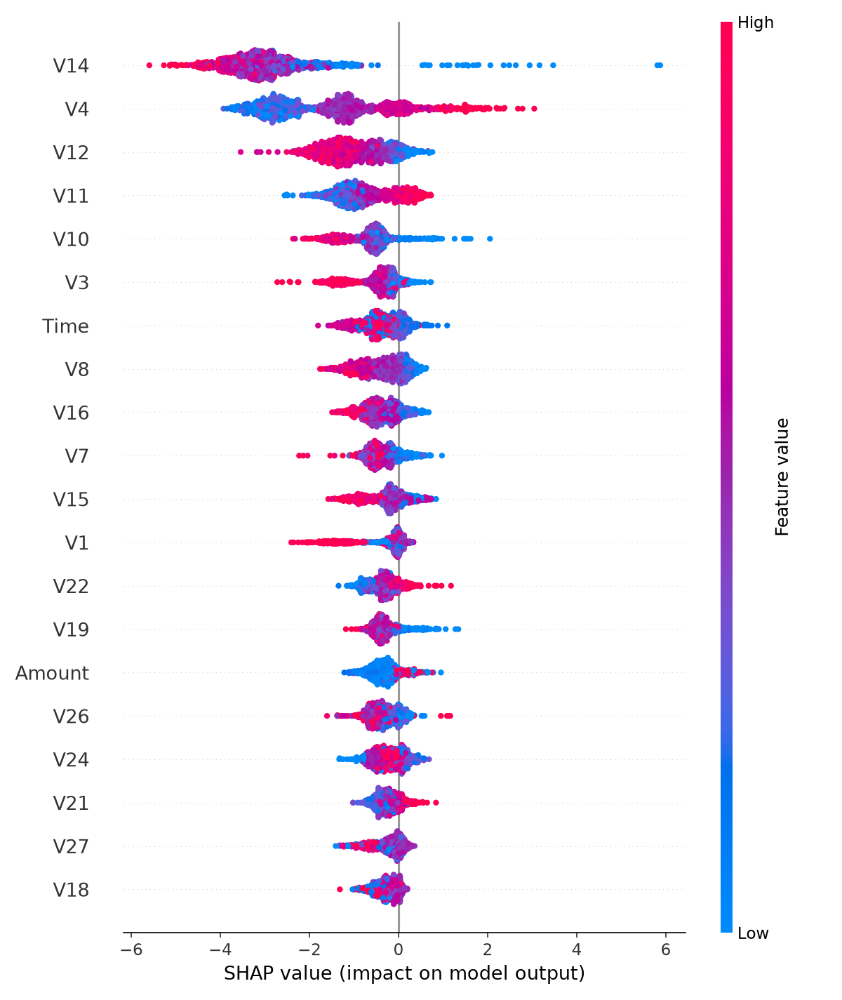

# Credit Card Fraud Detection

## Problem
Credit card fraud is rare (~0.17% of transactions in this dataset) but costly.
A model that's 99.8% accurate could still be useless if it just predicts
"not fraud" every time - so this project focuses on catching fraud without drowning in false alarms.

## Approach
- Dataset: Kaggle Credit Card Fraud Detection (284,807 transactions)
- Models: Logistic Regression (baseline) and XGBoost (final model)
- Handled class imbalance using class weighting (not naive resampling)
- Used PR-AUC instead of accuracy, since accuracy is misleading here
- Used SHAP to explain individual predictions, not just report a score

## Results
- Baseline PR-AUC: 0.7176
- XGBoost PR-AUC: 0.8791
- Confusion matrix:
                Predicted Normal | Predicted Fraud
Actual Normal:             56852 | 12
Actual Fraud:                 17 | 81

Caught 81 out of 98 actual fraud cases, with 12 false alarms.

## Explainability

The chart above shows which features most influenced the model's decisions.

## Live Demo
[Add your Streamlit Cloud link here once deployed]

## What I'd improve next
- Try SMOTE oversampling as an alternative to class weighting
- Add cost-based evaluation (weigh false negatives vs false positives by real dollar impact)
- Test how the model performs on more recent, out-of-sample fraud patterns